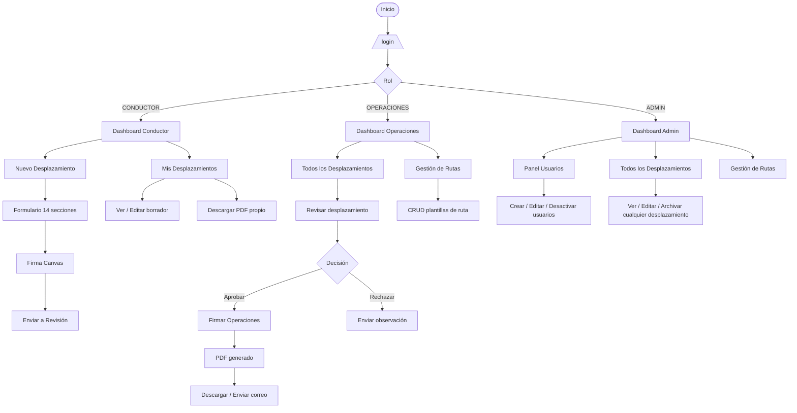
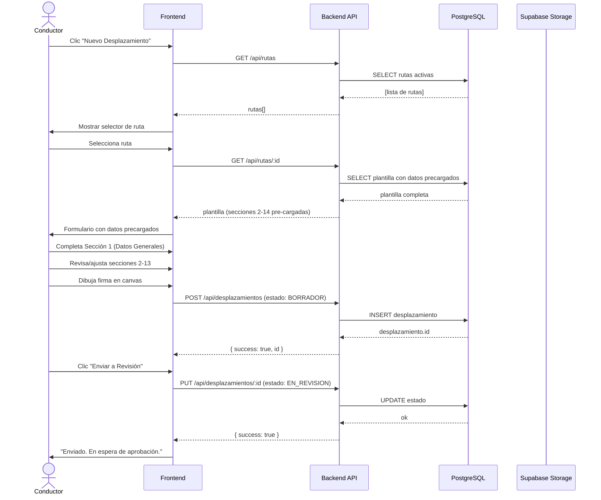
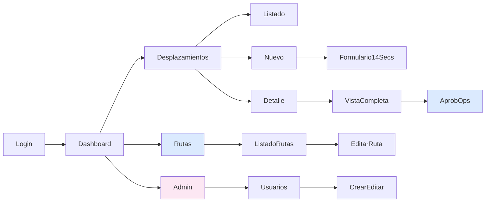

# Wireframes y Flujo de Usuario

**Fecha:** 2026-04-15  
**Formato:** Diagramas Mermaid + descripción de pantallas

---

## 1. Flujo de usuario por rol



---

## 2. Flujo detallado: Crear desplazamiento (Conductor)



---

## 3. Pantallas y layout

### 3.1 Login (`/login`)

```
┌──────────────────────────────────────┐
│  [Logo MECAT / empresa]              │
│                                      │
│  Planificación de Desplazamientos    │
│                                      │
│  ┌──────────────────────────────┐    │
│  │  Correo electrónico          │    │
│  └──────────────────────────────┘    │
│  ┌──────────────────────────────┐    │
│  │  Contraseña              👁  │    │
│  └──────────────────────────────┘    │
│                                      │
│  [ Ingresar ]                        │
│                                      │
│  ¿Olvidaste tu contraseña?           │
└──────────────────────────────────────┘
```

---

### 3.2 Dashboard (`/dashboard`)

```
┌─────────────────────────────────────────────────────────┐
│ [≡] Planif. Desplazamientos    [👤 Nombre] [Cerrar sesión]│
├──────────┬──────────────────────────────────────────────┤
│          │                                              │
│ Inicio   │  Resumen                                     │
│          │  ┌──────────┐ ┌──────────┐ ┌──────────┐     │
│ Desplaz. │  │ Borradores│ │En revisión│ │Aprobados │     │
│          │  │    3      │ │    1      │ │    12    │     │
│ Rutas    │  └──────────┘ └──────────┘ └──────────┘     │
│ (OPS)    │                                              │
│          │  Últimos desplazamientos                     │
│ Usuarios │  ┌─────────────────────────────────────────┐ │
│ (ADMIN)  │  │ Ruta          │ Fecha  │ Estado │ Acción│ │
│          │  │ Bloque Cubiro │ 14 abr │ ✅ Apro│  PDF  │ │
│          │  │ Sardinas      │ 12 abr │ 🔄 Rev │  Ver  │ │
│          │  └─────────────────────────────────────────┘ │
│          │                                              │
│          │  [ + Nuevo Desplazamiento ]                  │
└──────────┴──────────────────────────────────────────────┘
```

---

### 3.3 Listado de desplazamientos (`/dashboard/desplazamientos`)

```
┌─────────────────────────────────────────────────────────┐
│ Desplazamientos                    [ + Nuevo ]          │
├─────────────────────────────────────────────────────────┤
│ Filtros: [Ruta ▼] [Estado ▼] [Fecha inicio] [Fecha fin] │
│          [Conductor ▼ solo OPERACIONES/ADMIN]  [Buscar] │
├──────┬──────────────┬────────┬───────────┬─────┬───────┤
│  #   │ Ruta         │ Fecha  │ Conductor │ Est.│ Acc.  │
├──────┼──────────────┼────────┼───────────┼─────┼───────┤
│ 0042 │ Bloque Cubiro│ 15 abr │ J. García │  ✅ │ 👁 📄 │
│ 0041 │ Sardinas     │ 14 abr │ M. López  │  🔄 │ 👁 ✓  │
│ 0040 │ Yopal        │ 12 abr │ J. García │  📝 │ 👁 ✏  │
└──────┴──────────────┴────────┴───────────┴─────┴───────┘
│ Página 1 de 5   [ < ]  [ 1 2 3 ... 5 ]  [ > ]         │
└─────────────────────────────────────────────────────────┘

Leyenda: ✅ Aprobado  🔄 En revisión  📝 Borrador  ❌ Rechazado
```

---

### 3.4 Formulario nuevo desplazamiento (`/dashboard/desplazamientos/nuevo`)

```
┌─────────────────────────────────────────────────────────┐
│ ← Volver   Nuevo Desplazamiento          [Guardar borr.]│
├─────────────────────────────────────────────────────────┤
│ Selecciona la ruta:                                     │
│ ┌───────────────────────────────────┐                   │
│ │ 🔍 Buscar ruta...              ▼  │                   │
│ └───────────────────────────────────┘                   │
├─────────────────────────────────────────────────────────┤
│ Progreso: ████████░░░░░░░  4 / 14 secciones             │
├─────────────────────────────────────────────────────────┤
│                                                         │
│  ▼ 1. DATOS GENERALES                                   │
│  ─────────────────────────────────────────────────────  │
│  Motivo del desplazamiento:                             │
│  ┌────────────────────────────────────────────────┐     │
│  │                                                │     │
│  └────────────────────────────────────────────────┘     │
│  Tipo de vehículo:                                      │
│  ◉ Carga Pesada  ○ Transp. Personal  ○ Moto  ○ Público  │
│  ...                                                    │
│                                                         │
│  ▶ 2. RUTA PRINCIPAL          (pre-cargado)             │
│  ▶ 3. RUTAS ALTERNAS          (pre-cargado)             │
│  ▶ 4. RUTAS BLOQUEADAS        (pre-cargado)             │
│  ▶ 5. LÍMITES DE VELOCIDAD    (ingresar valores)        │
│  ▶ 6. SITIOS PERNOCTE         (pre-cargado)             │
│  ▶ ...                                                  │
│                                                         │
├─────────────────────────────────────────────────────────┤
│ FIRMA CONDUCTOR                                         │
│ ┌──────────────────────────────────────┐                │
│ │                                      │                │
│ │     [Área de firma táctil/mouse]     │                │
│ │                                      │                │
│ └──────────────────────────────────────┘                │
│ [Limpiar firma]                                         │
├─────────────────────────────────────────────────────────┤
│                    [ Enviar a Revisión ]                │
└─────────────────────────────────────────────────────────┘
```

---

### 3.5 Detalle / revisión desplazamiento (OPERACIONES)

```
┌─────────────────────────────────────────────────────────┐
│ ← Volver   Desplazamiento #0041 — EN REVISIÓN           │
├─────────────────────────────────────────────────────────┤
│ Conductor: Manuel López  │  Ruta: Sardinas              │
│ Fecha: 14 abr 2026       │  Hora salida: 06:00          │
├─────────────────────────────────────────────────────────┤
│ [ Vista completa del formulario — solo lectura ]        │
│                                                         │
│  1. Datos Generales ............. ✅                    │
│  2. Ruta Principal .............. ✅                    │
│  ...                                                    │
│  14. Planos de Ruta ............. ✅ [ver imagen]        │
│                                                         │
│  Firma Conductor: [imagen firma]                        │
├─────────────────────────────────────────────────────────┤
│ FIRMA OPERACIONES                                       │
│ ┌──────────────────────────────────────┐                │
│ │     [Área de firma táctil/mouse]     │                │
│ └──────────────────────────────────────┘                │
├─────────────────────────────────────────────────────────┤
│ Observaciones:                                          │
│ ┌────────────────────────────────────────────────┐     │
│ │                                                │     │
│ └────────────────────────────────────────────────┘     │
│                                                         │
│  [ Rechazar ]              [ ✅ Aprobar y Firmar ]      │
└─────────────────────────────────────────────────────────┘
```

---

### 3.6 Gestión de rutas — CRUD (OPERACIONES/ADMIN)

```
┌─────────────────────────────────────────────────────────┐
│ Plantillas de Rutas                   [ + Nueva Ruta ]  │
├────────────────────┬──────────────┬────────┬───────────┤
│ Nombre ruta        │ Variante Sec5│ Estado │ Acciones  │
├────────────────────┼──────────────┼────────┼───────────┤
│ Bloque Cubiro      │ KM Único     │ Activa │ ✏ 🗑      │
│ Sardinas           │ Cargado/Desc.│ Activa │ ✏ 🗑      │
│ Barqueréña/Maracas │ Cargado/Desc.│ Activa │ ✏ 🗑      │
│ SLP → Trinidad     │ Cargado/Desc.│ Activa │ ✏ 🗑      │
│ Lucero/Joropera    │ Cargado/Desc.│ Activa │ ✏ 🗑      │
│ SLP → Yopal        │ Cargado/Desc.│ Activa │ ✏ 🗑      │
└────────────────────┴──────────────┴────────┴───────────┘
```

---

## 4. Estructura de navegación



---

## 5. Responsive / móvil

- Formulario: secciones colapsables (acordeón), una abierta a la vez
- Tablas dinámicas (Secs. 6-12): scroll horizontal en móvil
- Firma canvas: área táctil de 100% ancho en móvil
- Listado: tarjetas en lugar de tabla en < 640px
- Navegación: menú hamburguesa en < 768px
